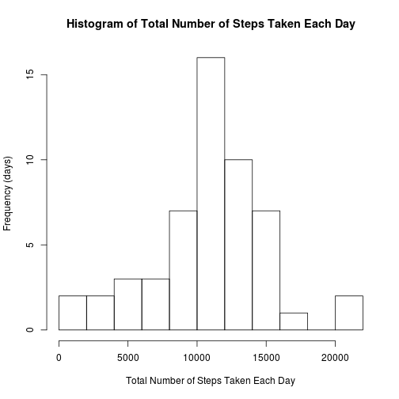

## Loading and preprocessing the data


```r
df <- read.csv(file = "activity.csv", stringsAsFactors = FALSE, header = TRUE)
df$date <- factor(df$date)
df$interval <- factor(df$interval)
```
## What is mean total number of steps taken per day?


```r
xname <- "Total Number of Steps Taken Each Day"
yname <- "Frequency (days)"

hist(tapply(df$steps, df$date, sum), breaks = "FD",
  main = paste("Histogram of", xname), xlab = xname, ylab = yname)
```

 

```r
sums <- tapply(df$steps, df$date, sum) 

print(paste("Mean:", as.character(format(mean(sums , na.rm = TRUE),
  digits = 7))))
```

```
## [1] "Mean: 10766.19"
```

```r
print(paste("Median", as.character(format(median(sums , na.rm = TRUE),
  digits = 7))))
```

```
## [1] "Median 10765"
```

## What is the average daily activity pattern?


```r
intmean <- data.frame(tapply(df$steps, df$interval, mean, na.rm = TRUE))
colnames(intmean) <- "mean"

x11()

xname2 <- "Interval"
yname2 <- "Average Number of Steps Taken"

plot(x = levels(df$interval), y = intmean$mean, xlab = xname2, ylab = yname2,
  main = yname2, type = "l")
```

 

```r
print(paste("Interval with maximum average numbers of steps:",
  attributes(intmean[which(intmean==max(intmean)),1])[[1]]))
```

```
## [1] "Interval with maximum average numbers of steps: 835"
```


## Imputing missing values

We'll use the mean value for each interval for the NAs.


```r
rm(df)
df <- read.csv(file = "activity.csv", stringsAsFactors = FALSE, header = TRUE)
df$date <- factor(df$date)
df$interval <- factor(df$interval)
print(paste("Number of NAs",length(df$steps[is.na(df$steps)])))
```

```
## [1] "Number of NAs 2304"
```

```r
df <- lapply(seq_along(which(is.na(df$step))),
  function(i){
    l <- which(levels(df$interval)==as.character(df[i,3]))
    df$step[i] <- intmean$mean[[l]]
 })

xname <- "Total Number of Steps Taken Each Day"
yname <- "Frequency (days)"

hist(tapply(df$steps, df$date, sum), breaks = "FD",
  main = paste("Histogram of", xname), xlab = xname, ylab = yname)
```

```
## Error in split.default(X, group): first argument must be a vector
```

## Are there differences in activity patterns between weekdays and weekends

```r
library(lattice)
days <- factor(weekdays(df$date))
```

```
## Error in UseMethod("weekdays"): no applicable method for 'weekdays' applied to an object of class "NULL"
```

```r
xyplot(intmean$mean ~ df$interval | weekday, intmean, 
       xlab = "Interval", ylab = "Steps", type = "l", lwd = 1,  
       layout=c(1,2))
```

```
## Error in eval(expr, envir, enclos): object 'weekday' not found
```


